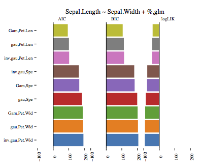

# beer

The aim of `beer` is to make it easier to automatically train and analyse data. 

## Usage

The main method is ``train.models``, used to train multiple models automatically and visualise on demand.

There are two options to train multiple models automatically: either by providing more than one distribution family (only applicable for classifiers which take a distribution family) or by replacing a part of the formula. The former is passed to ``train.models`` with the parameter ``fam``, the latter with parameter ``replacement``. The first example shows the latter, the second the former.

**First** example:

    t.m = train.models("Sepal.Length ~ Sepal.Width + %",
    					iris, 
    					algo="lm.linear_model",
    					replacement=c("Petal.Length","Petal.Width","Species"))
    			  
It trains a linear regression by using `lm` on the ``iris`` dataset. The algorithm is set by passing ``lm.linear_model`` in parameter ``algo``. Currently supported are 

* ``lm.linear_model`` (``lm``)
* ``glm.linear_model`` (``glm``)
* ``lmer.linear_model`` (``lmer`` from package ``lme4``)
* ``nlme.linear_model`` (``nlme`` from package ``lme4``).

Those are easily extendable, which is discussed under Section ``Extensability``. 

The first parameter is the formula, nothing changes except for the special character `%`. It is used as a replacement character. Parameter ``replacement`` takes a vector of column names of the passed data (in the **first** example ``iris``) that should replace ``%`` in the formula. As for now, only one replacement per formula is possible. If no ``%`` is used in the formula, no replacement can be used. The parameter becomes **optional**.

In the **first** example three lm-models are trained with the formulas and returned

* Sepal.Length ~ Sepal.Width + Petal.Length
* Sepal.Length ~ Sepal.Width + Petal.Width
* Sepal.Length ~ Sepal.Width + Species

Since `lm` does not take a distribution, only three models in total are trained. By default the results of the three models are **visualised**, printed as a **table** and an **anova** is run on it. The result of the visualisation can be seen here:

The **second** example uses `glm` to train the previous formula but also providing three distribution families.

    t.m = train.models("Sepal.Length ~ Sepal.Width + %", 
    					iris, 
    					algo="glm.linear_model",
    					fam=c("gaussian","inverse.gaussian","Gamma"), 
    					replacement=c("Petal.Length","Petal.Width","Species"))
    
Now what happens is it runs all possible combinations of the family and formula. Three replacements for the formula and three families equals nine trained models.

* Sepal.Length ~ Sepal.Width + Petal.Length with gaussian
* Sepal.Length ~ Sepal.Width + Petal.Length with inverse.gaussian
* Sepal.Length ~ Sepal.Width + Petal.Length with Gamma
* Sepal.Length ~ Sepal.Width + Petal.Width with gaussian
* Sepal.Length ~ Sepal.Width + Petal.Width with inverse.gaussian
* Sepal.Length ~ Sepal.Width + Petal.Width with Gamma
* Sepal.Length ~ Sepal.Width + Species with gaussian
* Sepal.Length ~ Sepal.Width + Species with inverse.gaussian
* Sepal.Length ~ Sepal.Width + Species with Gamma

The visualisation again shows AIC, BIC and logLIK values for all nine models:

As mentioned before, the output also includes a table of the performances of each model (AIC, BIC, logLIK) as well as the ``anova`` analysis. Both table outputs are shown below.

    Performance Table
    [1] "Sepal.Length ~ Sepal.Width + %"
                    AIC      BIC      logLIK   
    Gam,Pet.Len     93.58843 105.631  -42.79422
    gau,Pet.Len     101.0255 113.068  -46.51275
    inv.gau,Pet.Len 102.3047 114.3473 -47.15237
    inv.gau,Spe     164.8211 179.8743 -77.41055
    Gam,Spe         167.318  182.3712 -78.65899
    gau,Spe         183.9366 198.9898 -86.96829
    Gam,Pet.Wid     189.5796 201.6221 -90.78979
    gau,Pet.Wid     191.8207 203.8633 -91.91036
    inv.gau,Pet.Wid 194.147  206.1896 -93.07352
    
    
    ANOVA
    Analysis of Deviance Table
    
    Model 1: Sepal.Length ~ Sepal.Width + Petal.Length
    Model 2: Sepal.Length ~ Sepal.Width + Petal.Length
    Model 3: Sepal.Length ~ Sepal.Width + Petal.Length
    Model 4: Sepal.Length ~ Sepal.Width + Petal.Width
    Model 5: Sepal.Length ~ Sepal.Width + Petal.Width
    Model 6: Sepal.Length ~ Sepal.Width + Petal.Width
    Model 7: Sepal.Length ~ Sepal.Width + Species
    Model 8: Sepal.Length ~ Sepal.Width + Species
    Model 9: Sepal.Length ~ Sepal.Width + Species
      Resid. Df Resid. Dev Df Deviance
    1       147    16.3288            
    2       147     0.4640  0  15.8648
    3       147     0.0850  0   0.3789
    4       147    29.9111  0 -29.8261
    5       147     0.8794  0  29.0317
    6       147     0.1569  0   0.7226
    7       146    28.0037  1 -27.8468
    8       146     0.7482  0  27.2555
    9       146     0.1273  0   0.6209

Once the model is stored in a variable (in the examples it is stored ``t.m``), the generic methods ``plot``, ``print`` and ``anova`` can be used. E.g. ``plot(t.m)`` results in a ``ggplot2`` plot of AIC, BIC and logLik, showed in the two example images.

For more examples and the anova / table output check ``example(train.models)``.

## Extensability

Adding another classifier is simple. Create a function which name ends in ".linear_model". E.g. "gglm.linear_model". This is passed in ``train.models`` as parameter ``algo``.

The function should follow the four ``.linear_model``-functions in ``models.r`` and should use function ``linear_model`` to train the model. For now the latter is only a precaution in case ``linear_model`` will be used for more than just training in the future.

Example time:

    gbm.linear_model = function(formula,data,fam,...){
    	linear_model(formula,data,gbm,distribution=fam,...)    
    }
    
    t.m = train.models("Sepal.Length ~ Sepal.Width + %", 
                       iris, 
                       algo="gbm.linear_model",
                       fam=c("gaussian","multinomial"), 
                       replacement=c("Petal.Length","Petal.Width","Species"),output=F)
