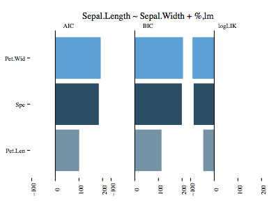

# beer

The aim of `beer` is to make it easier to automatically train and analyse data. 

# Usage

The main method is ``train.models``, used to train multiple models automatically and visualise on demand.

There are two options to train multiple models automatically: either by providing more than one distribution family (only applicable for classifiers which take a distribution family) or by replacing a part of the formula. The latter is shown by the first example.

The **first** example trains a linear regression by using `lm` on the iris dataset. 

    train.models("Sepal.Length ~ Sepal.Width + %", 
    			  iris, 
    			  algo="lm.linear_model",
    			  replacement=c("Petal.Length","Petal.Width","Species"))

The first parameter is the formula, which now takes a special character `%` as a replacement character. In this case three lm-models are trained with the formulas

* Sepal.Length ~ Sepal.Width + Petal.Length
* Sepal.Length ~ Sepal.Width + Petal.Width
* Sepal.Length ~ Sepal.Width + Species

are trained and returned. By default the results of the three models are **visualised**, printed as a **table** and an **anova** is run on it. The result of the visualisation can be seen here:

The **second** example uses `glm` to train the previous formula but also providing two distribution families.

    train.models("Sepal.Length ~ Sepal.Width + %", 
    			  iris, 
    			  algo="glm.linear_model",
    			  fam=c("gaussian","inverse.gaussian"), 
    			  replacement=c("Petal.Length","Petal.Width","Species"))
    

